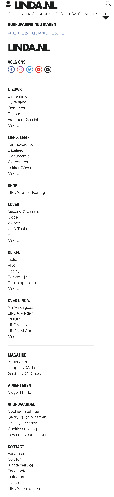
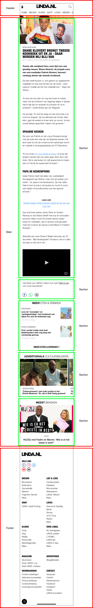
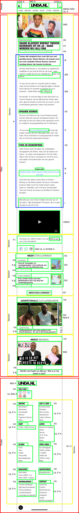

# Procesverslag
**Auteur:** Anniek Baarse

Markdown cheat cheet: [Hulp bij het schrijven van Markdown](https://github.com/adam-p/markdown-here/wiki/Markdown-Cheatsheet). Nb. de standaardstructuur en de spartaanse opmaak zijn helemaal prima. Het gaat om de inhoud van je procesverslag. Besteedt de tijd voor pracht en praal aan je website.

## Bronnenlijst
1. http://www.html-totaal.be/18.0-symbolen.htm
2. https://www.geeksforgeeks.org/how-to-add-icon-logo-in-title-bar-using-html/
3. https://www.xspdf.com/resolution/50161209.html
4. https://codeburst.io/how-to-create-horizontal-scrolling-containers-d8069651e9c6
5. -...-

## Huiswerkopdrachten
1. Typografie (oefening 1 en 2): https://codepen.io/anniekbaarse/pen/qBNQVaM
2. Positioneren (oefening 1): https://codepen.io/anniekbaarse/pen/JjKxaXe
3. Positioneren (oefening 2): https://codepen.io/anniekbaarse/pen/KKMJjQd
4. Flexbox (oefening 1): https://codepen.io/anniekbaarse/pen/xxOeMmK
5. Flexbox (oefening 2): https://codepen.io/anniekbaarse/pen/PozgLzQ
6. JS 3-stap (oefening 1): https://codepen.io/anniekbaarse/pen/qBNzyYb
7. JS 3-stap (oefening 2): https://codepen.io/anniekbaarse/pen/zYBVJqq
8. Grid (oefening 1): https://codepen.io/anniekbaarse/pen/GRjgBXK
9. Grid (oefening 2): https://codepen.io/anniekbaarse/pen/oNzgMrO
10. Media queries (oefening 1): https://codepen.io/anniekbaarse/pen/dypogWO?editors=1100
11. Media queries (oefening 2): https://codepen.io/anniekbaarse/pen/VwKLErp
12. Media queries (oefening 3): https://codepen.io/anniekbaarse/pen/vYXOVpZ
13. Animaties (oefening 1): https://codepen.io/anniekbaarse/pen/mdrPKor
14. Animaties (oefening 2): https://codepen.io/anniekbaarse/pen/QWKNxoQ?editors=1100

## Eindgesprek (week 7/8)

-dit ging goed & dit was lastig-

**Screenshot(s):**

-screenshot(s) van je eindresultaat-

## Voortgang 3 (week 6)

-same as voortgang 1-

## Voortgang 2 (week 5)

Ik heb aan mijn detailpagina niet heel veel tijd meer besteed. Deze is grotendeels al af, op een paar stylingsdingen na, waar ik nog even niet uitkom... Het enige wat mij (en de studentassisten) nog niet is gelukt, is van de header een scrollbar te maken, zoals ook op www.linda.nl te zien is. Daarnaast zijn er een aantal kleinere (detail) dingetjes nog steeds niet in CSS gelukt, zoals de afbeeldingen de volle breedte laten innemen (zonder padding/margin aan de zijkanten). Ook is het bij kleinere afbeeldingen ergens op de site niet gelukt om de juiste grootte mee te geven, deze zijn nu namelijk een beetje vervormd. Behalve aan de slider, heb ik aan de afbeeldingen nog niet heel veel aandacht besteedt.

Verder is mijn ontwerp nu nogsteeds echt puur gericht op smartphone formaat, maar doordat ik afbeeldingen width: 100% heb meegegeven, zullen deze (als je de site op desktop op full screen opent) de hele pagina in beslag nemen.

Ik had voorheen alleen nog maar mijn detailpagina, maar nu heb ik ook de gehele homepagina gemaakt. Ook deze is nog niet helemaal zoals ik het wil, maar hopelijk kom ik door middel van dit voortgangsgesprek weer een stapje dichterbij een heel mooi eindresultaat!

**Screenshot Homepagina Linda.nl:**

**Screenshot Detailpagina Linda.nl:**

Ik heb mij vooral gericht op de homepagina van www.linda.nl . Hier heb ik alle content in gezet en nu moet ik eigenlijk nog alles tot in de puntjes mooi maken met css en eventueel ook javascript. 

### Agenda voor meeting

| student 1: Anniek                                           | student 2:         | student 3:               | student 4:    |
| ---                                                         | ---                | ---                      | ---           |
| De slider in de header die nu fout gaat.                    | ---                | ---                      | ---           |
| De afbeeldingen goed schalen.                               | ---                | ---                      | ---           |
| De 'verschijnende' pagina als je op het account icon klikt. | ---                | ---                      | ---           |

### Verslag van meeting

-invullen na de meeting-

## Voortgang 1 (week 3)

### Stand van zaken

Aan het begin vond ik het heel lastig om een beginnetje te maken. Dit kwam omdat ik eigenlijk niet zo goed wist waar ik mee moest beginnen, doordat er zoveel content op de pagina's staat. Ook was het weer even inkomen met HTML en CSS, waardoor het extra moeite en tijd kostte om er iets moois ervan te maken. Toen ik eenmaal bezig was, ging het eigenlijk wel goed, totdat er meerdere dingen in CSS niet lukten... Gelukkig heeft de studentassistent mij hier heel ver mee kunnen helpen!

Het enige wat mij (en de studentassisten) nog niet is gelukt, is van de header een scrollbar te maken, zoals ook op www.linda.nl te zien is. Daarnaast zijn er een aantal kleinere (detail) dingetjes niet in CSS gelukt, zoals de afbeeldingen de volle breedte laten innemen (zonder padding/margin aan de zijkanten). Ook is het bij kleinere afbeeldingen ergens op de site niet gelukt om de juiste grootte mee te geven, deze zijn nu namelijk een beetje vervormd.

Verder is mijn ontwerp nu nog echt puur gericht op smartphone formaat, maar doordat ik afbeeldingen width: 100% heb meegegeven, zullen deze (als je de site op desktop op full screen opent) de hele pagina in beslag nemen.

Ik ben in ieder geval heel erg tevreden op wat ik tot nu toe heb gemaakt! Ik weet van mezelf dat ik niet de beste ben in HTML/CSS, maar zodra het dan toch allemaal lukt, ben ik wel altijd eventjes trots op het resultaat.

**Screenshot Homepagina Linda.nl:**

**Screenshot Detailpagina Linda.nl:**

Ik heb mij gericht op een detailpagina van www.linda.nl . Hier staat een artikel in over Shane Kluivert die een tweede kookboek uitbrengt. 

### Agenda voor meeting

| student 1: Anniek             | student 2: Gwyneth        | student 3: Chantal              | student 4: Mark   |
| ---                           | ---                       | ---                             | ---               |
| De slider in de header.       | De afbeeldingen in de slider 2 op de gamepagina. | Hoe ik het optijd ga afkrijgen. | Hoe kan ik icoontjes toevoegen voor en na tekst, '>' en bolletjes voor sliders.     |
| De breedte van afbeeldingen.  | Zoekbalk zonder streepje. |                                 | Moet elk drop-down ding/slide worden uitgewerkt.  |
| De footer die 2-koloms hoort. |                           |                                 | Social gedeelte heel lelijk op de echte site, moet dit ook zo uitgewerkt worden.               |

### Verslag van meeting

Ik vond de meeting eigenlijk niet heel erg 'nuttig'. Ik had verwacht dat het veel grootser of belangrijker was, zoals een soort van tussentijdse beoordeling, maar het leek naar mijn mening meer op een vragenuurtje. Ik heb dan ook de vragen gesteld over de dingen waar ik tegenaan loop, maar dit had ik een dag voor de meeting ook al gevraagd tijdens het vragenuurtje aan de studentassistent. Doordat zij dit ook niet zo goed wist, kwam ik eigenlijk niet heel veel verder.

## Breakdownschets (week 1)

## Intake (week 1)

**Je startniveau:** Mijn startniveau zit tussen blauw en rood in denk ik. Toch begin ik liever bij blauw, zodat ik altijd nog kan doorstromen naar rood als ik merk dat dat nodig is.

**Je focus:** Ik ga mij focussen op de surface plane (animaties, typografie, video, geluid...). Ik had graag mijn website responsive willen maken, maar de studentassistent heeft mij aangeraden dit niet te doen als ik niet zo goed ben in HTML en CSS, omdat www.linda.nl heel erg anders is op een groot scherm en ik denk dat dit toch echt te moeilijk wordt voor mezelf.

**Je opdracht:** https://www.linda.nl

**Screenshot(s) van de eerste pagina (small screen):**

**Screenshot(s) van de tweede pagina (small screen):**

